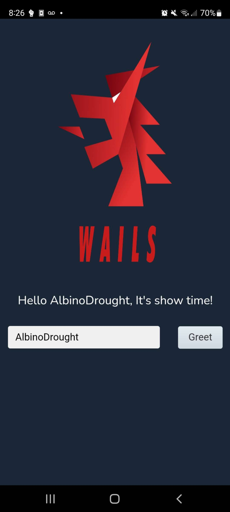

# Hack: Wails Android Proof-of-Concept

1. Clone this repository: `git clone https://github.com/AlbinoDrought/wails-android-test.git`
2. Enter the directory: `cd wails-android-test`
3. Initialize submodules: `git submodule update --init --recursive`
4. Install the hacky proof-of-concept version of Wails: `pushd wails/v2/cmd/wails && go install && popd`
5. Install [gomobile](https://pkg.go.dev/golang.org/x/mobile): `go install golang.org/x/mobile/cmd/gomobile@latest`
6. Install Android SDK 19, Android NDK Tools (I had better luck installing these with Android Studio)
7. Build our Wails app as an AAR using gomobile: `cd wailsdroid-test && make && cd ..` (alternatively, [run the Makefile commands directly](./wailsdroid-test/Makefile))
8. Build the sample Android application: I do this manually with Android Studio, it's in the [webview directory](./webview)

Screenshot:



Sample Logcat logs:

```
2022-09-10 20:26:08.595 24016-24107/? I/Wailsdroid: Request: GET wails://wails/
2022-09-10 20:26:08.606 24016-24107/? I/Wailsdroid: Response: HTTP 200 OK, text/html utf-8
2022-09-10 20:26:08.752 24016-24107/? I/Wailsdroid: Request: GET wails://wails/wails/ipc.js
2022-09-10 20:26:08.753 24016-24107/? I/Wailsdroid: Response: HTTP 200 OK, application/javascript 
2022-09-10 20:26:08.758 24016-24107/? I/Wailsdroid: Request: GET wails://wails/wails/runtime.js
2022-09-10 20:26:08.758 24016-24106/? I/Wailsdroid: Request: GET wails://wails/assets/index.ad5867ac.js
2022-09-10 20:26:08.759 24016-24102/? I/Wailsdroid: Request: GET wails://wails/assets/index.dbe33b87.css
2022-09-10 20:26:08.759 24016-24106/? I/Wailsdroid: Response: HTTP 200 OK, application/javascript 
2022-09-10 20:26:08.759 24016-24102/? I/Wailsdroid: Response: HTTP 200 OK, text/css utf-8
2022-09-10 20:26:08.764 24016-24107/? I/Wailsdroid: Response: HTTP 200 OK, application/javascript 
2022-09-10 20:26:08.872 24016-24180/? I/Wailsdroid: Received message: runtime:ready
2022-09-10 20:26:08.886 24016-24107/? I/Wailsdroid: Request: GET wails://wails/assets/nunito-v16-latin-regular.06f3af3f.woff2
2022-09-10 20:26:08.887 24016-24107/? I/Wailsdroid: Response: HTTP 200 OK, font/woff2 
2022-09-10 20:26:08.894 24016-24106/? I/Wailsdroid: Request: GET wails://wails/assets/logo-universal.cb3119ea.png
2022-09-10 20:26:08.895 24016-24106/? I/Wailsdroid: Response: HTTP 200 OK, image/png 
2022-09-10 20:26:23.221 24016-24180/? I/Wailsdroid: Received message: C{"name":"main.App.Greet","args":["AlbinoDrought"],"callbackID":"main.App.Greet-977632637"}
```

## Problems

- gomobile doesn't support arrays
- I don't know how to invoke main() without renaming the package to something other than `main` - gomobile refuses to compile it
- the AppPortal interface would be missing some methods when Java bindings were created (I'm assuming because unsupported types). This would cause AppPortal to be nil when sent back to Go (probably something like `appPortal, ok := interface.(AppPortal); ok == false` happening in the background)
- I couldn't get gomobile to build the aar when DialogOptions where included in the AppPortal interface, tried a few things (struct -> interface, arrays -> iterators, removing struct return types, removing two-value return types), I have no idea what's upsetting them, just commented out
- Sometimes the app UI is weirdly sized, like the page tried to render before the app was fully open
- Loading assets is slow? Maybe my phone? I think it's probably due to the way `InputStream` has been implemented (reading one byte per call)

## License

The Wails license can be found here: https://github.com/wailsapp/wails/blob/master/LICENSE

The webview template app license is unknown: https://github.com/slymax/webview

My changes are licensed under `CC0 1.0 Universal`
